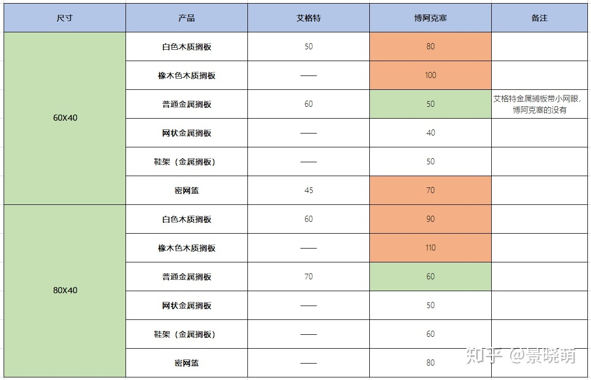

## 定制衣柜
细目工板尺寸 2440 * 1220

```javascript
var getSurface = (d, w, h) => d*w*2 + w*h*2 + d*h*2
var getExpanded = (d, w, h, vn, hn, ) => getSurface(d, w, h) - w*h

```
柜体展开面积（横竖背板）
上封板，相当于顶部的踢脚线
踢脚线，厨房铝合金有算，其它地方包含
竖收口，遮住立面缝隙的
侧封

表皮+10%


计算方法？
21 玄关柜高是2300，
20 厚应该是430
17 电视墙高是2300
17 烤漆开放柜？
29 书房书柜宽是2350, 高是2400
24 窗台柜厚是400高是300
19-20 厨房延米是2+0.6+2.35-0.6=4.35

免漆皮的收费
拉篮的收费

砌墙前去定位
顺便水电定位


1000 定位与设计
30% 确定预算
40% 复量下单板材
30% - 1000 安装前1天

不足0.5m按0.5算

200+860+465+3010+400+400=5335

| |厚|宽|高|
|-|-|-|-|
|玄关|430|2510|2300|
|电视柜|470|5335|2300|
|书房书柜|320|2350|2400|
|主卧窗边柜|400|2720|300|
|衣帽间衣柜|600|400|2300|

美标
高柜计价
包抽屉吗
免漆板的花纹

TOTO 外径37*55，年内无货

泉州市南安朴里东大路康富隆石业，18150383859韦凤禄收（大数据 天润海景）


37*55 lw596 无智洁釉面
40*55 lw546 605 


泉州TOTO: 28287070
37*55 900+50运费
5号放假
18960335801


## 开放式衣柜
### ALGOT 艾格特
配件主要有60cm或80cm间距可选

需要注意的是，挂条本身宽2.6cm，所以最好预留一些宽度出来。
1590mmx1640mm L型空间
6 + 6 + 4
8 + 8

被埋没的宜家神级产品艾格特，很多人只是不知道它到底有多神 - 住范儿石乐天的文章 - 知乎
https://zhuanlan.zhihu.com/p/44295341
> 如果你要做的是L形或C形的储物间/衣帽间，两端还得预留出艾格特的深度。
> 大部分情况下，墙面都不会被分得刚刚好，这是成品家具很难处理的情况，就由它去吧。
> 艾格特大部分配件只有3个宽度：40、60、80cm。
> 其中，60cm能搭配的配件最多，尽量优先选60cm的宽度来分割墙面。
### BOAXEL 博阿克塞
https://www.ikea.cn/cn/zh/cat/boaxel-bo-a-ke-sai-xi-lie-47394/

几万人都想买的网红艾格特停产，迎来更灵活的博阿克塞 - 景晓萌的文章 - 知乎
https://zhuanlan.zhihu.com/p/142370597

老款的艾格特挂条有三种尺寸，56cm，84cm，196cm，是可以自由拼接的（第一张图片里黑色组合就是）。
新款的博阿克塞只有两种的挂条，100cm和200cm。基本上就没有拼接的可能了，毕竟几个人家能用三米高的挂条呢。

在艾格特的主要生命周期里，有20、40、60三种深度的托架，分别搭配对应深度的主配件来使用。
到了博阿克塞这儿，不常用的60也没了，就只剩下40cm一种尺寸可选。托架也从双层中空钢板换成了单片钢板，安装是简单了不少，不过有种不如老款结实的感觉。

所以目前为止，博阿克塞在20cm深度配件上是缺失的。
除了深度以外，博阿克塞目前也没有艾格特曾经有过的单杆配件。

博阿克塞在一个最核心的方面——**宽度**上做到了更灵活：
推出了两款可调节配件，搁板和挂衣杆。支持在20~30cm间调节

https://www.ikea.cn/cn/zh/p/boaxel-bo-a-ke-sai-ke-tiao-jie-ge-ban-bai-se-80465571/ "搁板" 
https://www.ikea.cn/cn/zh/p/boaxel-bo-a-ke-sai-ke-tiao-shi-gua-yi-gan-bai-se-20465569/ "挂衣杆"

然后，在经典配件方面，博阿克塞去掉了深度29cm的密网篮，只提供15cm一种（29的确实很少用）。但宽度方面同时提供60和80cm两种可选。
在搁板方面，给出了更多的选择。除了艾格特有的普通白色木质搁板、金属搁板，还提供了白橡木色木质搁板，提供更好的质感。

当然价格也小幅上涨，整体25%左右



其实新款也有优点，这个优点不是很明显，但让我们选购方便了很多。
先看老款。老款艾格特组合完成后，安装实际占用的宽度一直比较难算。
因为除了主配件的宽度（40/60/80），托架和挂条自身的宽度也需要计算在内。
上图的四种组合里，实际宽度就是88（80+8），65（60+5），230（40+60+60+60+10），190（60+60+60+10）。
到底是+5，+8还是+10，这个数字是怎么算的？有没有感觉很迷。

但新款的博阿克塞就没有这个问题了。
得益于单层钢板托架那几乎没有的厚度，**博阿克塞的组合整体宽度，就是主配件宽度+2cm**。
这个2cm是整个方案里，最外侧的两根挂条，各外延1cm产生的。
所以博阿克塞的实际组合宽度计算非常简单，不会像艾格特那样有可能算不清楚而出错。

[1]: https://zhuanlan.zhihu.com/p/32277187 "干货|史上最全板式家具结构与连接方式"

金属踢脚线
玄关橱柜门
镜灯色温4000K
厨房挡水条打磨到平窗台
加配电视柜层板尺寸：1片463mmx444mm 1片454mmx444mmx
自带灯带开槽深度4mm，宽度10mm
20天安装（五一前）


CSSKBF
108
98 

148-40=108=80+28 
138=60+60+18=80+58

148=60+60+28
138-40=98=60+30+8
