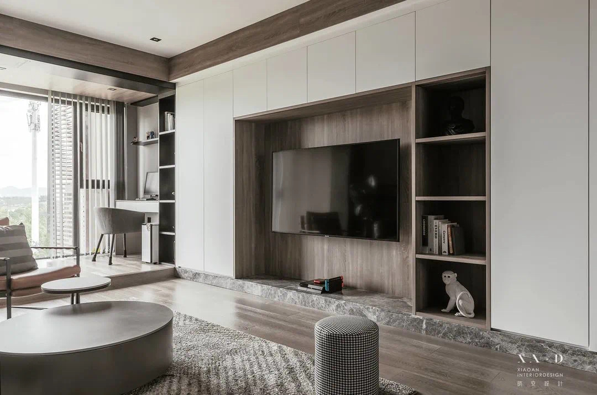

# 修改建议

## 卧室
床头可以做个造型（参考下图）或像客厅沙发后面那样凹进去的空间。用来放置书，投影仪，Switch，或者可以用其他方式实现。

原来的蓝色太深了，希望用上图里的蓝色

衣帽间希望有个像客厅电视柜的单列（足够放下一个包宽度就好）玻璃橱窗，如下图

衣帽间希望有个全身镜

## 客厅
原来的客厅的绿色很漂亮，。全屋也希望按这个链接里的风格靠：http://xhslink.com/EHyTu

电视柜要有收纳空间各种设备：电视盒子，PS5，XBOX，NAS。因为这些设备都是立式的，所以希望放在一个方形的空间中，集中管理。同时那个空间要考虑散热问题。因为设备在高温环境下会影响性能和寿命

电视柜下图中选中部分不要，加高下方镂空，和上方抽屉高度。

电视柜感觉不太对称，整体色块的分配感觉不太规整（见下图）

看看能不能弄得更规整，类似下图

## 空调

1拖1 7.2KW 6000 + 1500 = 7500
1拖1 3.5KW 6000 + 1500 = 5500
total = 13000

1拖2 4500 + 3000 + 8400 + 1500 * 2 = 19000

## 回路
空调 5
餐厅厨房 2 烤箱单独
主卫 1
副卫 1
客厅阳台 2 音响单独
弱电箱 1
书房阳台 1
主卧次卧 1

总 13回

## CAD
### V1.0
- E02 客厅设备柜的高度之前沟通的应该是400，图纸里是250。下方的储物空间可以不用那么高，足够放进收纳箱就好
- E04 抽油烟机，燃气灶，和下方的柜子，希望可以对齐
- E05 冰箱要留双开门的宽度
- E14 书房门后的柜体感觉不够放进行李箱（至少需要30cm）和A3大小的印刷品，看能不能加点深度
- P09 没有标注音箱预留孔位。
- 目录标错了，P09应该是插座图纸，P10是开关的图纸

### V1.1
- 主卧入口开关和空调面板移到床头，主卧玄关的灯开关独立

- 过道上方，主卧上方，需要留有网络出口，用来装吸顶AP，这个在设计图里没有体现。见图2

- 各个独立空间都需要有网口以安装AP，包括主卫，副卫，次卧，以达到信号全覆盖
- 客厅阳台的照明，独立开关会不会好点。
- 厨房靠窗案台处的照明似乎没有，感觉可以在出风口两侧安装射灯
- 厨房台面插座少了，至少要4个，电饭煲，微波炉，豆浆机，料理机，面包机
- 电视柜下方需要有插座以安装灯带
- 电视柜上方是有灯带照明吗？
- 次卧飘窗处预留插座
- 主卧窗边柜上方预留插座（小台灯或灯带）
- 主卧窗边柜旁边预留插座（落地音箱）
- 主卧投影仪插座的预留位置不是天花板，是床头正上方，同时也需要2个插座，包括
- 卫生间的镜柜旁边都要留两个插座，一个电吹风，一个电动牙刷
- 回路的规划，施工如何保证？
- 施工误差要求？如何书面化到合同里？
- 

### V1.2
有窗帘的地方，在上方都需要预留电动窗帘的插座
淋浴房用玻璃隔断
过道的漏了一个吸顶插座和网线接口
门口智能监控需要预留电线和网线

https://docs.google.com/spreadsheets/d/16zewlS3TGZpgBWsemUVT-p_3EBSNG6LKlCHoCx_8jjM/edit#gid=475921358

## 施工预算沟通

不包含搬运到物业指定垃圾点费用。
不包洁具安装: 马桶有包
弱电箱，强电箱业主自购: 200一个
砂浆厚度不超过5公分，每超一公分加3元: 一般是不会超过
半吊及造型吊顶面积按2倍计算: 合理

门窗
洁具
电器
灯具

硅酸板平面吊顶
一级半吊
二级半吊

淋浴房铺贴下水槽
淋浴房铺贴大理石

### 一些原材料的价格
山泽六类线 ￥550/300m [1]
网线100m ￥239 [4]

山泽电线1.5平 ￥159/100m [2]
山泽电线2.5平 ￥229/100m
山泽电线4平 ￥269/100m
电线100m ￥250

日丰管 4分 ￥20/m
日丰管 6分 ￥30/m
水管100m ￥2500

酷达斯

煤气安装时间
电视柜柱子的处理
美縫 7~10/m

### 装修合同
直铺砖的美缝，另外请人，
水电辅材的价格，√
pvc管项目
界面剂，
腻子：水性成品腻子: 坚牌2000

合同签订20%
敲打 
砌墙
水电
泥水
木工完工30%
油漆
工程验收20%

瓷砖 4080 70

工期
保修

### 装修备注
- [ ] 吊环安装
- [ ] 弱电箱配置：raspberry pi
- [ ] 多层板性能优于大芯板

[1]: https://detail.tmall.com/item.htm?id=25419616675
[2]: https://detail.tmall.com/item.htm?id=557102325276
[3]: https://detail.tmall.com/item.htm?id=577565599738
[4]: https://detail.tmall.com/item.htm?id=25419616675

懿品居瓷砖|章茵|13860167710 福建省厦门市湖里区金尚路富贵门别墅1期107栋
大数据橱柜|阿练

魏总接下来你要准备的材料有
防盗门
瓷砖
厨房水电图
木地板只需要厚度
石材先定好等我通知、挡水条、地漏等

防盗门已经确定款式，就是门的高度需要调整一下。
瓷砖已经确定款式了。之后等瓷砖那确定尺寸就可以定了。
木地板按1.8的厚度来吧

卫生间做完防水试水试了半个月请问对以后的使用会有影响吗？ - 智漏-龚文的回答 - 知乎
> 试水最多48小时
> 现在对于试水，业主通常有二种想法，其实都是不对的。一是试水时间越长越好，不漏的话就是好防水。其实不是的，防水材料是防水，但不能长期高压泡水，日积月累，防水层很快就会泡坏的。

https://www.zhihu.com/question/332467719/answer/733774860

地漏位置要结合瓷砖规划好位置。一般靠墙角放不会错