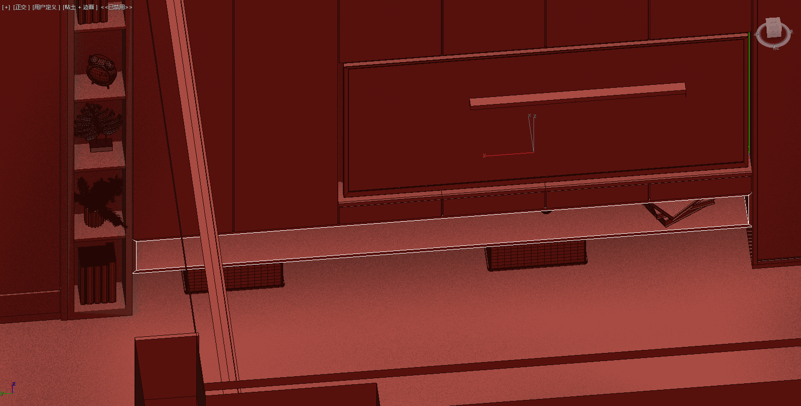

# 修改建议

1) 冰箱要留上水和额外空间，以便升级成大号的自动制冰冰箱
2) 电视柜要有隐藏的收纳空间给设备：电视盒子，ps5，xbox，电脑主机
3) 电视柜下图中选中部分不要，加高下方镂空，和上方抽屉高度。
4) 电视柜感觉不太对称
5) 床头可以做个造型（参考下图）或像客厅沙发后面那样凹进去的空间。用来放置书，投影仪，Switch。或者可以用其他方式实现。
6) 原来的蓝色太深了，希望用上图里的蓝色
7) 衣帽间希望有个像客厅电视柜的单列（足够放下一个包宽度就好）玻璃橱窗，如下图

7) 衣帽间希望有个全身镜
8) 原来的客厅的绿色很漂亮，。全屋也希望按这个链接里的风格靠：http://xhslink.com/EHyTu

柜体宽470 高1900 厚480

板材厚度9mm

地面至吊顶高度2400

右边柜体总宽度3830

承重柱宽 425

玻璃柜宽 300

板材厚度30

左边门 400 * 3

左边柜体总宽度 1250