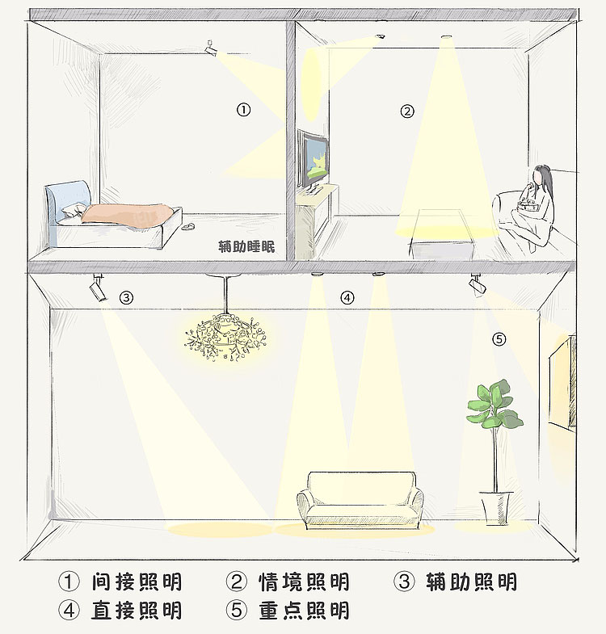

# 灯光设计

## 基础知识

选择遮光角45度的灯具
光线会经过反光杯和透镜
磨砂镜片可以防眩

光源深度需要大于拇指长度才可以使遮光角大于45度
光源深度大的灯具对吊顶高度有要求
使用光学透镜可以减少深度的同时，加大遮光角
蜂窝风格也可减少眩光，但光损大。
蜂窝+深筒+暗面反射+反光杯，可以实现0眩光，但光损严重

[漫画讲灯第一期 现代筒灯和射灯的区别](http://www.yidoutang.com/guide-12513.html)

[漫画讲灯第⼆期 筒、射、轨道灯的选择和使⽤](http://www.yidoutang.com/guide-13423.html)

- 射灯距离墙面30~50cm，通过调节方向，来调整光斑的洗墙效果
- 洗墙不照墙，光束要落地，拉高天花板。
- 间接光打亮家具，呈现材质美
- 洗墙灯间距80~100cm，可适当加长，原因是人的步子60cm，在动线上无眩光。
通过人的步子来确定洗墙灯的间距的论述这个感觉挺扯蛋的，人眼视角在垂直方向的可视角度是[150°](https://en.wikipedia.org/wiki/Field_of_view#cite_ref-Traquair_5-0)，90 - 150 / 2 = **15**，
以角度较大的45°的光束为例，45 / 2 - **15** = 7.5，而只要人眼在这7.5°的范围内平视都会有一定眩光的情况，而这其实与步幅没什么关系。而用37度的灯可以将这个范围减少到3.5°。
但其实更有效的方法是调节灯光向视线的方向倾斜。但如果是双向动线的情况，就必须加遮光罩等手段来彻底规避眩光的问题

但后来进一步查阅发现，人的视线方位在垂直角度并不是[上下对称的][1]。同时有效可视角度只有120°，因此在上方的可视角度只有50°。换句话说，只要光束角超过40度，都不会有眩光问题。

[漫画讲灯第三期 如何布局家里的筒、射、轨道灯？](http://www.yidoutang.com/guide-12652.html)
较宽光束角**37°**为例，在层高**2.8-3米**的居室中，打到地面的光域是一个直径约为**2米**的圆。因此，灯间距离最大可为**2米**，45°光束角则d1最大可为**2.5米**。
2.7 * tan(45 / 2) * 2 = 2.2m。
2.7 * tan(37 / 2) * 2 = 1.8m。
根据案例经验，我们黄种人对亮度的感官大于实际需要的数值，为此可以缩短灯间距来增加亮度，建议间隔1-1.5米安装一个灯。

1. 左右两边射灯（光束角37°），中间3个筒灯（光束角45°），2种灯具遮光角都在45°，所以站在45°切线上拍照，毫无眩光。
2. 左右两边的射灯距离墙面30cm，但基于它可以调节方向，往里调一点，光斑就在墙上往上走，往下调一点，光斑就从墙上往下走。为此开孔离墙面的距离不会让你太拘束，我们推荐离墙距离是30-50cm之间，依据整体美观度选择。
3. 洗墙效果，右边灯与灯的距离是80cm，我们推荐均匀洗墙灯间距离是80-100cm,具体原因往下拉，有图解。左边则没有均匀布局灯具，这是个重点！完全没有必要均匀布置，一切取决于家里位置的功能布局，图中沙发上方可以不设置灯具，后续用落地灯补光。中间三盏做主照明距离可以根据现场情况随意。如果你做的是散点照明，建议放下“对称美”的成见。

[灯带设计——让你的家里出光如画](http://www.yidoutang.com/guide-55232.html)

## 光束角  遮光角 截光角
http://www.360doc.com/content/16/0506/10/248984_556698589.shtml

光束角：指垂直光线中心线的某平面上，发光强度等于50%最大光强的两个方向之间的夹角
遮光角：指淘汰最边缘一点与灯具开口边缘的连线与水平线之间的夹角
截光角：遮光角的余角
照度: 每单位面积所接收的光通量
光通量: 表示光功率的物理量，是表示光源整体亮度的指标，单位是注明

## 需求
电视柜洗墙灯
灯带
沙发灯带
床头灯带

## 需要配置智能开关的地方，
- 客厅总开关
- 主卧入户开关
可以使用[泛影智能灯带][3]配合[调光开关][4]使用。

## 筒灯
https://zhuanlan.zhihu.com/p/266596428
> 客厅：4-5W/平，4000K或以下
> 餐厅：4-5W/平，2700-3000K为宜，不过4000K
> 厨房：5-6W/平，4000K，实在不习惯的可以选择白光。
> 卧室：2-3W/平，2700-3000K

> 家用灯具满足色容差＜8SDCM,Rg＞90，90＜Rf＜110，完全够用。

~10
测试有飞利浦恒灵dn190b、松下灿放、三款筒灯。
共同点：功率都在3-4W之间，价格都在￥10元内。

~20
三雄极光星际3

20~30
西顿1201g2 yeelight-03yl

灯具交流圈
https://www.zhihu.com/club/1305142765287333888

你为显色指数交了多少智商税？ - 灯饰照明狂人的文章 - 知乎
https://zhuanlan.zhihu.com/p/336795281

客厅面积 4*4=16
16 * 5 = 80W
80 / 10灯 = 8

厨房面积 3.5*2.5/2=4
4*6=24
24/3 = 8

卧室 2.7*3=5
5*3=15
15

170 明装暗装一样

## 格栅灯
5*2W 适合卧室中间
3*5W 239

## 灯带

22/M
68/条

主卧少算了3m

2.8*2+2.9+2.9*2+2.2+3.9 = 20.4
2+1+2+1+1 = 7

## 感应灯
夏天气温较高的时候，红外感应灯具的敏感度和感应距离都会下降。

声控一般用于公共场合，优点是待机功耗低，造价便宜缺点是触发效率低，一般楼道里那种需要跺脚才亮，室内不穿鞋就难以触发。
红外灯触发好，以前对室温要求高，现在和光敏电阻配合以后问题不大。。待机功耗也低，造价贵。
雷达感应触发率非常高，甚至高到成了弱点。比如墙的另一侧有人走动也会触发。。。造价一般，但是优秀的控制器很贵。。另外待机功耗很高。。

## 明装磁吸灯

## QA
磁吸灯是否通用

[1]: https://www.epd.gov.hk/eia/register/report/eiareport/eia_2522017/EIA/html/Appendix/Appendix%2011.1.pdf
[2]: https://zhuanlan.zhihu.com/p/85688897 "橱柜灯安装"
[3]: https://detail.tmall.com/item.htm?id=597277685310
[4]: https://detail.tmall.com/item.htm?id=612163343308