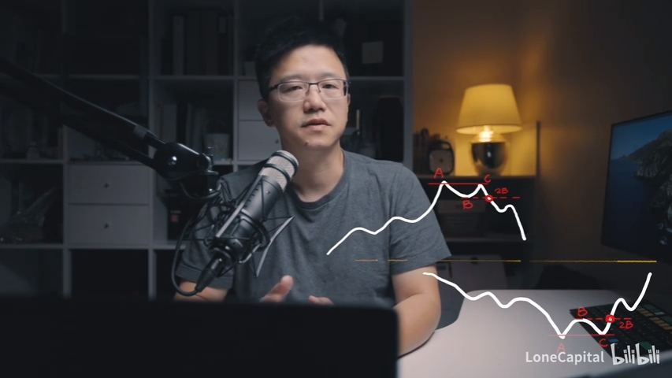
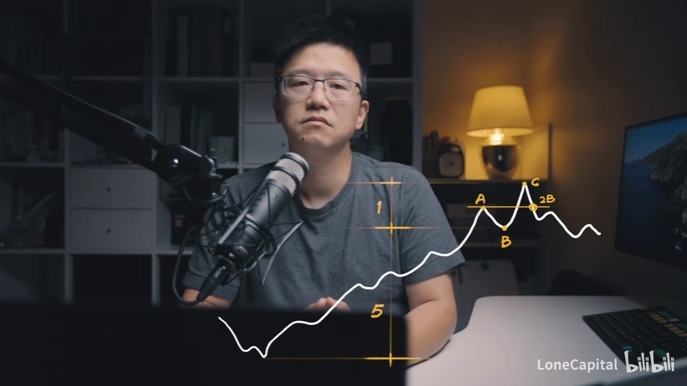
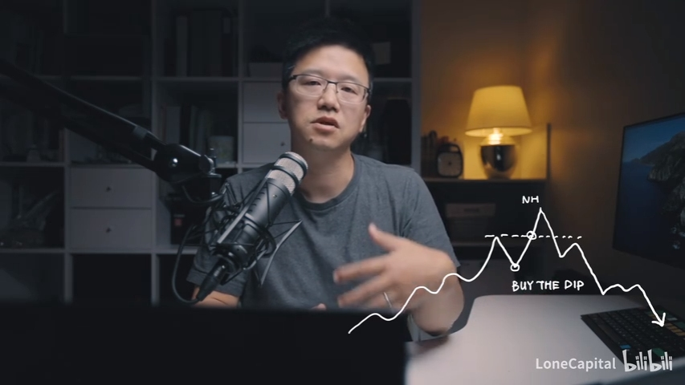
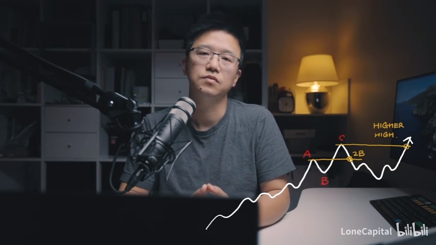
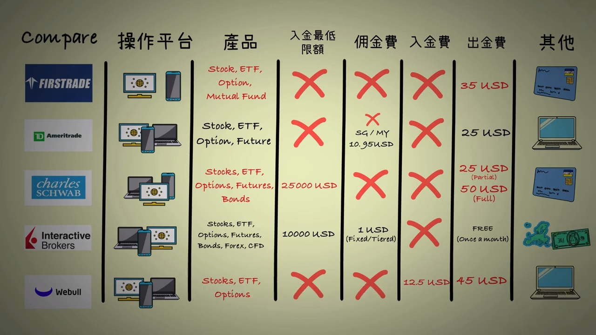
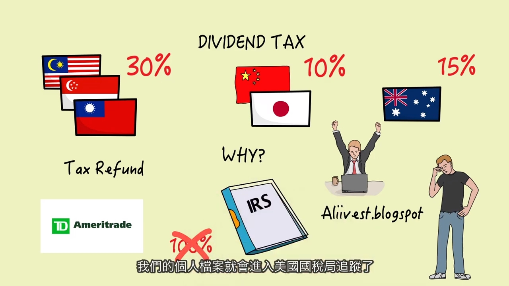

[如何监控异动][1]

[三十本投資經典][2]
https://read.douban.com/reader/ebook/110808848/

[1]: https://help.futu5.com/faq/topic2874 "如何监控异动"
[2]: https://lonecapital.com/membership/877/

市场标志性动作

每一段行情的开启或结束，都会有一个标志性动作
此动作以及紧随其后的一系列动作（效应叠加），会指明趋势运行的方向

2B的概念来源于《专业投机原理》，是交易+市场行为学著作
2B动作的效果，是要创造人性之极

一些基本的2B趋势:

要点一：在2B之前，已经出现大幅上涨或下跌（其高度占趋势总高度较小｜<1/5）

要点二：2B结构的目的是引导市场极端情绪（亢奋or恐慌）
要点三：2B是一个快节奏动作

《孙子兵法》曰：兵之情主速，乘人之不及；由不虞之道，攻其所不戒也。

Buy the Dip > Buy the Breakthrough > 套牢 >（逼迫绝望情绪）止损 > 加速2B > 趋势迅速反转
 

长期浸润于市场，感知市场的脉搏和心跳，培养对市场的深度洞察力

2B -> 3B -> ... -> nB，都有可能。重点是感觉市场情绪

2B的后续动作，应当朝趋势反转的方向发展，因此2B点离20均线不能太远，否则无法迅速破线拐头。因此其出现的位置通常距离20均线和20抵扣价不会太远（以便迅速破线拐头反转趋势）

当2B失败趋势反转事宜愿为（Higher High or Lower Low），C点突破后就要走人。什么原则进，什么原则出，必须遵守交易纪律和底线止损出场

2B是趋势起点，是盈亏比极高的位置，难度很大，成功率不高，但值得去做
2B结构是交易高手的必修课

### 零佣金券商

股息税并不是100%可以退
一旦退税档案就会进入IRS，之后都要如实报税

有额外的出金费用35$

### 量化投资的边际效应递减
如果整个股市都用量化投资，量化投资是不是就没用了？[6]
量化交易不是银弹[7]
量化基金年收益率

什么是alpha[8]

A股到底能不能做股票量化投资？ - 徐杨的文章 - 知乎
https://zhuanlan.zhihu.com/p/52029649

https://www.zhihu.com/search?q=A%E8%82%A1%20%E9%87%8F%E5%8C%96&type=content

用“机器学习”做“股票预测”能做到什么程度？ - 知乎
https://www.zhihu.com/question/20147343/answer/265593500

### 机器学习是否可能应用于市场
有可能，但你用什么数据去训练？

### TODO 通过企业当前收益进行估值的方法

[1]: http://hk.cmbc.com.cn/home/notice/2020/08/1201757293771903.htm
[2]: https://www.firstrade.com/content/zh-cn/pricing/ "FIRSTRADE收费"
[3]: https://invest.firstrade.com/cgi-bin/main#/content/customerservice/pricing/
[3.1]: firstrade.com/content/en-us/customerservice/faqs "FIRSTRADE FAQ"
[4]: https://www.firstrade.com/content/zh-cn/promos/freeacat
[5]: https://coderschool.cn/3337.html "香港支付宝支持转数快充值"
[6]: https://www.zhihu.com/question/373173440/answer/1030287067
[7]: https://zhuanlan.zhihu.com/p/25719525 "给正在从事量化交易、准备从量化交易的人一些忠告 - 大圣股评的文章 - 知乎"

[8]: https://www.investopedia.com/terms/a/alpha.asp