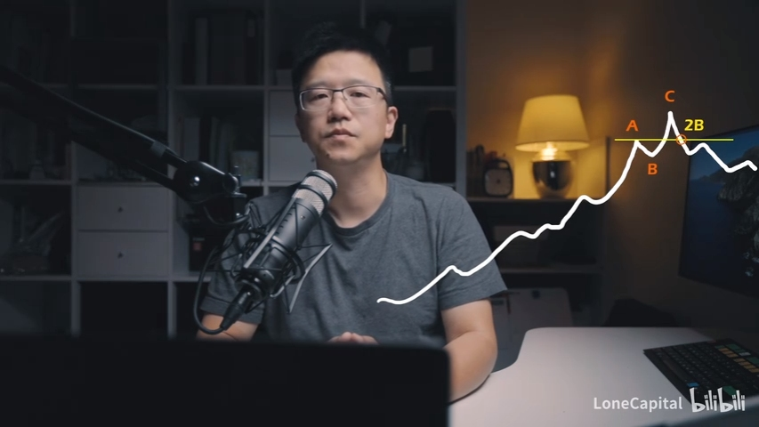

[如何监控异动][1]

[三十本投資經典][2]
https://read.douban.com/reader/ebook/110808848/

[1]: https://help.futu5.com/faq/topic2874 "如何监控异动"
[2]: https://lonecapital.com/membership/877/

市场标志性动作

每一段行情的开启或结束，都会有一个标志性动作
此动作以及紧随其后的一系列动作（效应叠加），会指明趋势运行的方向

2B的概念来源于《专业投机原理》，是交易+市场行为学著作
2B动作的效果，是要创造人性之极

一些基本的2B趋势:

要点一：在2B之前，已经出现大幅上涨或下跌（其高度占趋势总高度较小｜<1/5）

要点二：2B结构的目的是引导市场极端情绪（亢奋or恐慌）
要点三：2B是一个快节奏动作

《孙子兵法》曰：兵之情主速，乘人之不及；由不虞之道，攻其所不戒也。

Buy the Dip > Buy the Breakthrough > 套牢 >（逼迫绝望情绪）止损 > 加速2B > 趋势迅速反转
 

长期浸润于市场，感知市场的脉搏和心跳，培养对市场的深度洞察力

2B -> 3B -> ... -> nB，都有可能。重点是感觉市场情绪

2B的后续动作，应当朝趋势反转的方向发展，因此2B点离20均线不能太远，否则无法迅速破线拐头。因此其出现的位置通常距离20均线和20抵扣价不会太远（以便迅速破线拐头反转趋势）

当2B失败趋势反转事宜愿为（Higher High or Lower Low），C点突破后就要走人。什么原则进，什么原则出，必须遵守交易纪律和底线止损出场

2B是趋势起点，是盈亏比极高的位置，难度很大，成功率不高，但值得去做
2B结构是交易高手的必修课

### 机遇
电子烟
电池技术
低生育率带来的产业
中国投资的东南亚企业
https://www.iyiou.com/analysis/202007091005578 "阿里腾讯们投资东南亚"
全球化视野下，在经济领域的新模式有着洞察式见解的期刊（或者信息源是？）

https://www.zhihu.com/question/442679833 如何看待中国生育报告显示「全面二孩政策后反而出现生育断崖」，人口老龄化、少子化时代加速到来？""
> 此外要加快构建生育支持体系：实行差异化的个税抵扣及经济补贴政策，覆盖从怀孕保健到18岁或学历教育结束；加大托育服务供给，大力提升0-3岁入托率并对隔代照料实行经济鼓励；进一步完善女性就业权益保障，并对企业实行生育税收优惠；加强保障非婚生育的平等权利；加大教育医疗投入，保持房价长期稳定，降低抚养直接成本，等等。
### 策略
先用较激进的价格short put，待吸收到标的后，再以空头跨式策略赚取持续收益。
相当于不断赚取期权的时间价值与波动价值，但本质上是卖保险给空头与多头，最大的敌人是波动率。
如果短期有看高的或看低的方向，则卖空单腿期权。买入期望方向的期权

### 零佣金券商

股息税并不是100%可以退
一旦退税档案就会进入IRS，之后都要如实报税

有额外的出金费用35$

### 量化投资的边际效应递减
如果整个股市都用量化投资，量化投资是不是就没用了？[6]
量化交易不是银弹[7]
量化基金年收益率

什么是alpha[8]

A股到底能不能做股票量化投资？ - 徐杨的文章 - 知乎
https://zhuanlan.zhihu.com/p/52029649

https://www.zhihu.com/search?q=A%E8%82%A1%20%E9%87%8F%E5%8C%96&type=content

用“机器学习”做“股票预测”能做到什么程度？ - 知乎
https://www.zhihu.com/question/20147343/answer/265593500

### 机器学习是否可能应用于市场
有可能，但你用什么数据去训练？

### TODO 通过企业当前收益进行估值的方法

### Firstrade传入资金
ACATS
http://d4l0yihtmj3iw.cloudfront.net/forms/zh-cn/transfer_form.pdf?v=20210114

#### 为什么可以实现零佣金
https://www.zhitongcaijing.com/content/detail/246641.html
https://blog.usstocks.com.tw/?p=1881

https://www.youtube.com/watch?v=6p9hXdtCNHs "美股券商零佣金一定比收佣金好吗？｜顺便谈谈做市商制度（20191227）"
https://www.chainnews.com/articles/098059010300.htm "一文读懂 DeFi 自动做市商崛起原因、尚存局限和未来前景"

> 据上述券商人士的说法，下面的场景可以说明出售订单流对投资者的影响：假如你持有一只股票，目前买卖价在$334对$335.01，你对着买价直接下$334/股的卖出单，如果结果立刻成交回报在$334.5，每一股成交价改进了50美分，可见券商没有卖订单流，优化价格最佳；但假设订单流被卖给了高频做市商，高频商若不做任何优化，这个订单就可能以$334/股直接成交，转手再卖$334.5，之间的无风险价差套利为50美分。尽管不违反NBBO的成交规则，高频商可能将成交价稍微进行优化，中间的套利仍然十分丰厚。

> 举个例子,如果你的股票目前买价是10美元,卖价是10.50美元,成交价可能会经过优化,以10.30美元成交。而如果你的订单流被美股券商卖给高频做市商,若后者不做任何价格撮合上的优化,该交易订单可能会以10美元直接成交,然后高频交易商转手再以10.30美元的价格卖出,中间就有30美分的套利空间。

20/10/28 201120 40.00 下单价1.30 成交价1.33 这3美元就是最优成交的价格。
但以我目前的交易量，零佣金券商仍是最划算的选择，但要考虑到入金与出金的手续费。

目前一年内我的平台佣金为270美元，属于可以接受的水平

https://www.youtube.com/watch?v=gw195PTBdr8 "国内外券商对比"

https://www.fidelity.com/learning-center/overview

https://www.youtube.com/watch?v=AHcU94W0waA "美国花旗银行开户" 
vleo银行开启虽然0门槛，但国内已经不支持电汇
但似乎可以用民生银行转到vleo
香港花旗需要100万港币门槛
transferwise资金回国

https://www.youtube.com/watch?v=4Sw0SXySZWg "标准国际银行" 
野鸡银行，出入金费用昂贵

### Webull
https://www.webull.com/zh/hc/categories/fq138-
从民生香港入金费用
12.5美元(webull) +20美元(民生) = 32.5美元
2.1-2.28 首入1000美元，送$9*5 + $50 SNAP(电汇)

电汇入金	12.5美元/笔
电汇出金	45美元/笔
股息税由美国税务局收取，在派发市时自动扣除：(同时适用富途和微牛)
1. 美国用户：收取30%的派息所得税；
2. 中国用户：收取10%的派息所得税。

https://www.webull.com/zh/hc/categories/fq960- "微牛证券美股账户国际电汇入金参考信息--民生银行"
https://www.webull.com/zh/hc/categories/fq562- "融资融券账户保证金要求的比例是多少？"
https://support.futuhk.com/zh-cn/topic342?lang=zh-cn&from_platform=1 "futu什么是保证金率"

融资利息
futu 4.8%
webull 7%
firstrade 8.75%

### Velo
https://www.velobank.com/zh/products/checking-account/factsheet.html
汇出美国 40美元 
汇入 10美元

[1]: http://hk.cmbc.com.cn/home/notice/2020/08/1201757293771903.htm
[2]: https://www.firstrade.com/content/zh-cn/pricing/ "FIRSTRADE收费"
[3]: https://invest.firstrade.com/cgi-bin/main#/content/customerservice/pricing/
[3.1]: firstrade.com/content/en-us/customerservice/faqs "FIRSTRADE FAQ"
[4]: https://www.firstrade.com/content/zh-cn/promos/freeacat
[5]: https://coderschool.cn/3337.html "香港支付宝支持转数快充值"
[6]: https://www.zhihu.com/question/373173440/answer/1030287067
[7]: https://zhuanlan.zhihu.com/p/25719525 "给正在从事量化交易、准备从量化交易的人一些忠告 - 大圣股评的文章 - 知乎"

[8]: https://www.investopedia.com/terms/a/alpha.asp
