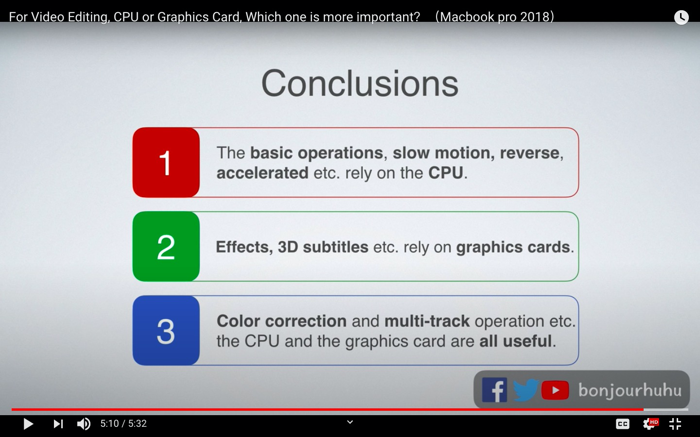
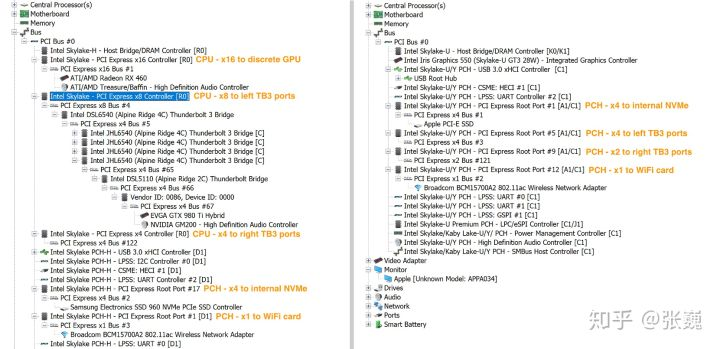

# MacBook Pro

Final Cut Pro
Webpack

13inch 
i5 4核 1.4Ghz  940  3883 yes
i7 4核 1.7Ghz  1050 3960 
 +11.7% $2202

选到与16inch同等入门配置时:
512GB SSD
16GB RAM
i7 1.7Ghz CPU

是 $16728 vs $18999 = $2271 = 更大的屏幕， 更好的多核运算能力

16inch
i7 6核 2.6Ghz 1037 5441 $21201 yes
i9 8核 2.3Ghz 1090 6701 $22199 
i9 8核 2.4Ghz  1129 7022
+8% $2466??

16GB RAM $1468
512GB SSD $1559

香港换购才￥1100，同时在中国是￥2200

https://forums.macrumors.com/threads/fcp-x-and-cpu-cores.1989932/

https://browser.geekbench.com/mac-benchmarks

2017-mid MBA 单核 667 多核 1372(2)
2015-mid MPB 单核 931 多核 3364(4)

$1299 vs $1799 2020 MacBook Pro 13" - Full Comparison!
https://www.youtube.com/watch?v=jK3AOK8uDJo

	$1299	$1799	2017 Macbook Air
接口	2	4	
CPU单核	925	1214 (+31.2%)	667
CPU多核	3928	4358 (+10%)	1372
GPU	6855	10154(+48%)	
FCPX	43s	36s(-16% time)(+19% power)	
Cinebench	1548	1917(+23%)，但之前测试是1708(+10%)	
			

4K LUT 2020 MacBook Air 10th i5
GPU使用率从17%升到65%，但CPU使用率几乎没有变化。
相对的，如果只是1080P，就只是上升了10%
https://www.youtube.com/watch?v=DuTPerwdr2c

CPU	GPU
17%	17%
18%	65%

同样的CPU同样的显卡，2019款的FCPX测试是65s(对比43s)，太tm神奇了
对把CPU逼到极限频率，双风扇的温度反而更高。=    =

Cinebench 1548 vs 1917(但上一次测试是1708)

Max的视频剪辑频道
https://www.youtube.com/user/Maksimyuryev

选购指南
https://www.youtube.com/watch?v=xojEpQ8UfCA

Video does benefit from more RAM
不过即使是现在10thCPU最好的集显（10242）也比16寸的显卡差得多（24286）

https://zhuanlan.zhihu.com/p/111182798

扩展坞
https://zhuanlan.zhihu.com/p/111182798

扩展坞使用场景：
单显示屏，2K至4K
USB连接NAS

eGPU
https://zhuanlan.zhihu.com/p/64752548

关于视频剪辑与Macbook
https://www.youtube.com/watch?v=tOY784F7aSQ

BruceX测试（更测重于GPU）
https://www.fcp.co/forum/hardware/18250-brucex-try-this-new-final-cut-pro-x-benchmark

Multi-User Thunderbolt 3 NAS for Video Editing - QNAP TS-453BT3 - 1 Year Review
https://www.youtube.com/watch?v=SFFlHwnYjeg
视频中提到，如果要进行视频编辑的话，连接NAS还是需要通过Thunderbolt3线来连接
硬盘读写速度是300MB/WRITE，600MB/READ，用的Disk Speed Test来测试

802.11ac即WIFI5最大1Gbps 128MB/s
802.11ad扩展版最大7Gbps 
802.11ax即WIFI6最大11Gbps
802.1.1ay扩展版标准理论最大176Gbps
5G理论最大10Gbps

千兆带宽理论上限是128MB/s

显示器6bit 8bit 10bit 12bit和srgb，ntsc，adobergb什么关系？ - 李世培的回答 - 知乎
https://www.zhihu.com/question/49465792/answer/130955987

显示位宽测试
https://webkit.org/blog-files/color-gamut/

Which component is more important for video editing-CPU or GPU?
https://www.youtube.com/watch?v=K4OgY6xjz9Y
https://www.youtube.com/results?search_query=cpu+vs+gpu+video+editing+

显卡导出速度
https://youtu.be/tOY784F7aSQ?t=455

https://www.idownloadblog.com/2016/01/09/how-to-achieve-faster-video-exports-in-final-cut-pro-x/

	CPU	GPU
Rendering	o	x
Color correction effect	o	o
transition	o	o
3D subtitles	x	o
Slow motion	50%	x
reverse	50%	x
accelerate	50%	x
effects, (shape mask, spot, etc, nut no color correction)	x	o
Multi-tracks(no effects)	x	o


1080 * 1920 * 4 * 60 * 3 * 8 / 8 =  1.5GBps * 8 = 12Gbps

1080P需要 3Gbps

总量是5Gbps

当然你也可以去某些Mac软件下载平台上开一个会员，下载安装所有的Mac软件，包括Final Cut Pro X，几百块就可以终身更新使，比如http://lapulace.com。

PCIE接口速率和显卡
https://www.zhihu.com/question/309461685
eGPU性能损失
https://www.v2ex.com/t/478995
https://egpu.io/forums/mac-setup/pcie-slot-dgpu-vs-thunderbolt-3-egpu-internal-display-test/

如何评价外置显卡？ - 孤独凤凰战士的回答 - 知乎
https://www.zhihu.com/question/67965694/answer/490636786
南桥的雷电3共享DMI3.0总线，需要分享PCIEx4（低压U是PCIEx2）的带宽，

雷电3外接显卡性能损耗严重的原因是什么？ - jixi mu的回答 - 知乎
https://www.zhihu.com/question/364711437/answer/963324302

2018时代变了！雷电3配件强力升级，雷电3的世界降临 - 张巍的文章 - 知乎
https://zhuanlan.zhihu.com/p/44298112
如何评价外置显卡？ - 张巍的回答 - 知乎
https://www.zhihu.com/question/67965694/answer/573351240

另外知乎里有文章说说低压U的雷电三都是接在南桥的，这个是事实。
左图15寸MacBook Pro (2016款) 标压处理器就是北桥直连雷电三，
右图13寸版本(2016款)是南桥接入。亲测2018款13寸的雷电3控制器也都是连接到南桥的。
所以，理论上，考虑到还有大量的高速设备接入南桥，从而很易在南北桥之间形成的瓶颈；
但从测试的情况看，至少2018款几乎不存在这类的影响。
性能损失在15%左右：2750 分对比 微星的17寸游戏本GT75的3270分

.jpg)

PD充电会影响电池寿命吗？
会有一点，但电池可更换，所以其实还好。

$1800 MBP + eGPU vs 16’’ MBP
https://www.youtube.com/watch?v=WciRf8iRm8U

$1799 MacBook Pro 2020 Long-Term Review - We Were Wrong!
https://www.youtube.com/watch?v=u_eDOvrbnOE

eGPU Comparison with 2020 MacBook Pros - $1299 vs $1799
https://www.youtube.com/watch?v=UyK5YR89Kcc

