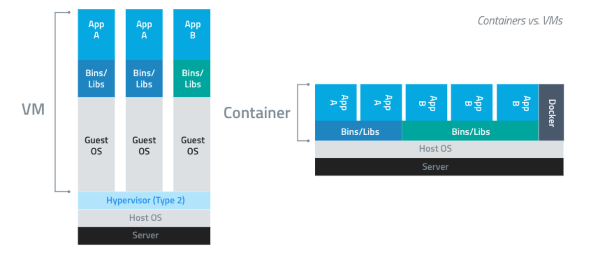

# NAS

搭建家庭NAS服务器的方案[很多][1]，重点能过以下几方面选择适合你自己的（根据重要性降序）：
1) 当前的需求
2) 未来的需求
3) 已有的硬件
4) 预算

对于普通的家用需求来说，[J3455][2]配OpenMediaVault是便宜好用的[选择][3]

## 硬件

QNAP也支持Docker，甚至最基础的[ARM机型]也支持(https://www.qnap.com/zh-cn/product/ts-212p3/specs/software)

QNAP部分机型支持[升级内存](https://www.qnap.com/en/support/con_show.php?cid=9)

QNAP闪存只是用来存储[开机系统]，所以大小无所谓(https://forum.qnap.com/viewtopic.php?t=130842)


https://www.qnap.com/zh-cn/how-to/tutorial/multimedia

如何通过 DLNA/UPnP 欣赏存储在 QNAP NAS 上的多媒体内容？
藉由 myQNAPcloud 服务存取您的 QNAP 装置
如何使用 Video Station 管理影片?
一次学会 Transmission 下载
如何使用 Aria2 进行迅雷离线下载
计算机免开机 P2P 下载

[Docker运行时关于**内存**，CPU，GPU的配置](https://docs.docker.com/config/containers/resource_constraints/)

[获取当前运行容器的内存占用](https://docs.docker.com/engine/reference/commandline/stats/)


https://m.tb.cn/h.V2eJTbo?sm=2710eb
4盘位NAS ITX机箱 flex电源
￥289 （机箱）+ ￥107（电源）
需要ITX主板

内存条
H110M
DDR4

CPU LGA1151

E3-1285l v3 9981
G4560 4861


家用是[不需要用7类网线][5]，用超6类就够了。大概[￥2.8每米](https://detail.tmall.com/item.htm?id=592380154094)

freeNAS + ZFS
unRaid

## 虚拟化技术

目前比较好上手的虚拟化技术有esxi和docker。然而尽管两种技术都可以提供对底层硬件的虚拟化，但却是[不同层面][4]的东西。两者可以互相独立运行，也可以组合在一起使用（但服务器领域应用比较多）。

esxi等虚拟机是对底层硬件的完整抽象，因此在其上可以运行**完整的操作系统**。这给了exsi更好的隔离性，操作性。但代价是更大硬件消耗和需求。

而docker是运行在操作系统上的（也就是说，可以运行在exsi里的Guest OS）。
docker有三个重要的概念：docker引擎，docker容器，docker镜像
docker引擎运行在操作系统上，docker容器利用docker引擎运行，可以将其看作一个极简的Linux系统环境（包括root权限、进程空间、用户空间和网络空间等）。而在docker容器是通过docker镜像创建。

不同的容器间是共同相同的系统组件的。也因此docker镜像只需打包宿主系统上没有的组件，并且相同的底层模块是可以共用的。也因此相对exsi来说docker对于机器的利用率更高，这也是我更推荐docker的原因。

另一个重要的原因是，docker的部署相对于exsi来说简单得多。利用docker镜像，就可以创建相同的docker容器，省去了烦琐的配置与调试。


尽管额外的OP会让SSD有[更好的性能][8]和寿命，但你并不需要自己手动配置未分区空间来作为OP，Knet Smith在[这里][9]具体解释到提到：
> When a user does not fill the entire range of LBAs known to Windows, the controller automatically uses that space as dynamic over-provisioning (assuming the OS and SSD support TRIM).

> If you never store more than 750GB of data and keep TRIM on (dont disable it), you will see the same performance as the guy who creates a 750GB partition.


NAT性能需要大于带宽，才不会造成[瓶颈][11]
无论是不是[公网IP][12]，光猫都要设置为桥接模式，才能让下发的IP落在路由器上，然后再配合端口转发或DMZ（不推荐，会让NAS暴露在互联网下没有防火墙保护）就可以从公网访问NAS服务了

公网IP，端口转发，动态域名[12]，用白群晖的话有他自己的域名服务

Transmission[13]

NFS相较SMBCPU占用较低

## 软件

Jellyfin文件管理
https://jellyfin.org/docs/general/server/media/shows.html

远程关机
https://jingyan.baidu.com/article/e2284b2b5a99e4e2e6118d0e.html

远程开机
https://www.zhihu.com/question/338705949/answer/912480378

外网无法访问的问题：
https://whatismyipaddress.com/
https://bbs.ui.com.cn/t/ip/49132 "有公网ip，端口映射后外网无法访问"
https://bbs.ui.com.cn/t/edgerouter-dnat/41657 "DNAT"
https://www.zhihu.com/question/278726503

## 内存管理

我刚刚咨询了一下技术主管
当我们只有一块SSD做系统盘的话，交换分区是不会占用这块SSD的空间的
[17]

```
[~] # cat /proc/swaps
Filename                                Type            Size    Used    Priority
/dev/md256                              partition       530108  495228  -1
/dev/md322                              partition       7235132 598584  -2
/share/CACHEDEV1_DATA/.swap/qnap_swap   file            16777212        0       -3
[~] # cd /share/CACHEDEV1_DATA/.swap/
[/share/CACHEDEV1_DATA/.swap] # ls
qnap_swap
[/share/CACHEDEV1_DATA/.swap] # swapon -p 0 ./qnap_swap
swapon: ./qnap_swap: Device or resource busy
[/share/CACHEDEV1_DATA/.swap] # swapoff ./qnap_swap
[/share/CACHEDEV1_DATA/.swap] # swapon -p 0 ./qnap_swap
```

```javascript
async function scrollByPage(el, callback = () => {}) {
    const y = el.scrollTop + el.clientHeight
    el.scroll(0, y)
    window.requestAnimationFrame(() => {
        callback(el)
        if (y < el.scrollHeight) scrollByPage(el, callback)
    })
}
function selectAllWithinWindow() {
    [...document.querySelectorAll('.col')].forEach(col => {
        const checkbox = [...col.children[0].children[0].children]
            .find(child => child.className.includes('Checkbox'))
        if (!checkbox.children[0].children[0].attributes['xlink:href'].value.includes('box_selected_normal')) {
            checkbox.click()
        }
    })
}
function selectAll() {
    const scrollContainer = document.querySelector('.ReactVirtualized__Grid')
    scrollContainer.scroll(0, 0)
    selectAllWithinWindow()
    scrollByPage(scrollContainer, selectAllWithinWindow)
}
```

cp /share/CACHEDEV1_DATA/.system/autorun/autorun.sh

autorun.sh
```
swapoff -a
swapon -p 0 /share/CACHEDEV1_DATA/.swap/qnap_swap
```

```
mount /dev/mmcblk0p5 /tmp/config
vi /tmp/config/autorun.sh
chmod +x /tmp/config/autorun.sh
umount /tmp/config
```

## CAYIN MediaSign Player - Plus version license
5fd037afb35010242ef69a5a

[1]: https://www.zhihu.com/question/21359049/answer/34375825
[2]: https://s.taobao.com/search?q=J3455
[3]: https://www.bilibili.com/video/BV18W411f7u9?t=5m49s
[4]: https://www.upguard.com/blog/docker-vs-vmware-how-do-they-stack-up
[5]: https://www.zhihu.com/question/317765503/answer/1055708744 "家庭装修，现在网线布六类还是七类线比较好？ - 大盗的回答 - 知乎"
[6]: https://www.quora.com/Is-the-speed-of-SSD-and-RAM-the-same "SSD比内存慢了两个数量级"
[7]: https://unix.stackexchange.com/questions/2658/why-use-swap-when-there-is-more-than-enough-free-space-in-ram "linux会把内存中比较少用到的部分放到swap里"
[8]: https://www.anandtech.com/show/6489/playing-with-op "预留空间对SSD的影响"
[9]: https://blog.seagate.com/intelligent/gassing-up-your-ssd/
[9.1]: https://forums.anandtech.com/threads/a-question-about-overprovisioning-in-ssds.2497601/
[10]: https://www.techspot.com/news/52835-understanding-ssds-the-need-for-trim-overprovisioning-and-more.html
[11]: https://www.bilibili.com/video/BV1vz411b7tC?t=1m52s
[12]: https://www.bilibili.com/video/BV1Z4411n7JB?t=3m58s
[12.1]: https://www.v2ex.com/t/582688 "如何得到公网IP"
[13]: https://www.bilibili.com/video/BV1H4411p7LA?t=19m02s
[14]: https://www.tinymediamanager.org/
[15]: https://post.smzdm.com/p/a4wmwkrl/ "利用tinyMediaManager刮削影片，解决plex电影墙的问题"
[16]: https://www.bilibili.com/video/av94293208/
[17]: https://forum.qnap.com/viewtopic.php?t=149957
[17]: https://forum.qnap.com/viewtopic.php?t=130345
[17]: https://wiki.qnap.com/wiki/Running_Your_Own_Application_at_Startup#Manual_edit_of_autorun.sh
[18]: https://www.thegeekdiary.com/centos-rhel-how-to-prioritize-the-devices-used-for-swap-partition/